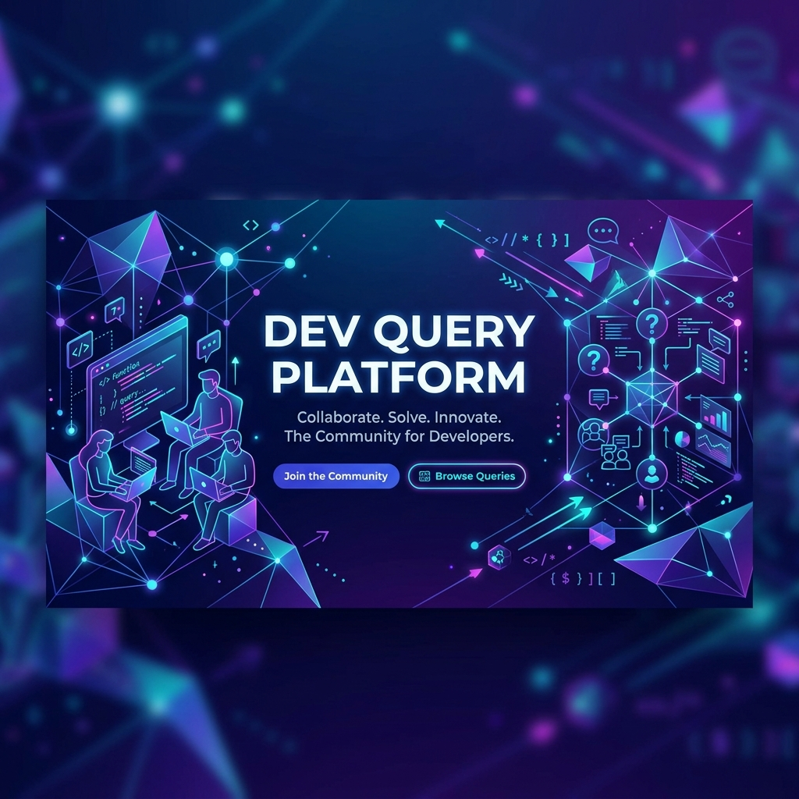

# Dev Query Platform 🚀



A robust, professional full-stack Q&A platform designed for developers to ask technical questions, share knowledge, and collaborate in real-time. Built with a modern monorepo architecture leveraging **NestJS**, **Next.js**, and **TypeScript**.

[](https://bun.sh)
[](https://nextjs.org)
[](https://nestjs.com)
[](https://www.typescriptlang.org)

---

## 🛠 Tech Stack

### Frontend (`apps/web`)
- **Framework:** Next.js 16+ (App Router)
- **Styling:** Tailwind CSS 4, Shadcn UI
- **Components:** Shadcn UI
- **Real-time:** Socket.io-client for live updates

### Backend (`apps/api`)
- **Framework:** NestJS
- **ORM:** TypeORM with MySQL/SQLite support
- **Real-time:** WebSockets (Socket.io)
- **Validation:** Class-validator & Class-transformer
- **AI Integration:** OpenAI-ready moderation (Planned)

### Infrastructure & Tooling
- **Runtime:** Bun (Fastest JS/TS runtime)
- **Monorepo Management:** Bun Workspaces
- **Shared Package:** Common types and utilities in `packages/shared`

---

## 🏗 Architecture

The project follows a modular monorepo structure to ensure scalability and code reuse:

```text

├── apps/
│   ├── api/        # NestJS Backend API
│   └── web/        # Next.js Frontend Application
├── packages/
│   └── shared/     # Shared TypeScript interfaces and utilities
├── assets/         # Project design assets and diagrams
├── docs/           # Documentation
└── package.json    # Root workspace configuration
```

---

## ✨ Features

### Core Functionality
- **Question Dashboard:** Paginated/Filtered list of recent technical queries.
- **Dynamic Detail Pages:** Full question display with nested answers.
- **Engagement:** Submit questions and post solutions with a clean UI.
- **Search:** Keyword-based search across titles and descriptions.

### Advanced Capabilities
- **Real-time Collaboration:** Live notifications when new answers are posted and active viewer counters via WebSockets.
- **Reputation System:** Upvote/Downvote mechanics for questions and answers to build user credibility.
- **Verified Solutions:** Authors can mark specific answers as the "Accepted Solution".
- **Markdown Support:** Full syntax highlighting for code blocks in questions and answers.
- **Tagging System:** Categorize questions with technical tags (e.g., `react`, `nestjs`, `bun`).

---

## 🚀 Getting Started

### Prerequisites
- [Bun](https://bun.sh) installed (Recommended: v1.3.13+)

### Installation
```bash
# Clone the repository
git clone https://github.com/bakadja/dev-query-platform.git
cd dev-query-platform

# Install dependencies
bun install
```

### Running the Project
You can run both the frontend and backend simultaneously from the root:

```bash
# Start all services in development mode
bun run dev
```

Individual service commands:
```bash
# Run only the API
bun run dev:api

# Run only the Web client
bun run dev:web
```

---

## 📝 Scripts

| Command | Description |
| :--- | :--- |
| `bun run dev` | Starts API and Web apps concurrently |
| `bun run lint` | Runs ESLint across the entire workspace |
| `bun run format` | Formats code using Prettier |
| `bun run build` | Builds all applications for production |

---

## 📄 License
Distributed under the MIT License. See `LICENSE` for more information.

---
Built with ❤️ for the Developer Community.
